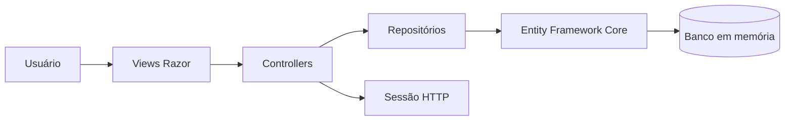
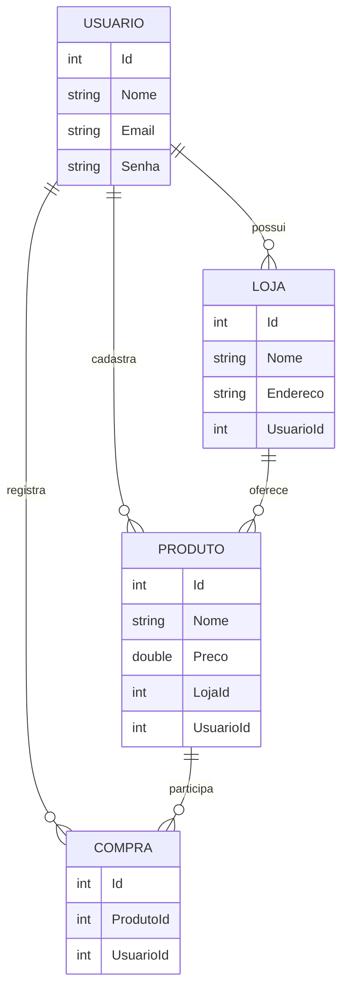

<h1 align="center">Sistema de Gerenciamento de Compras</h1>

<p align="center">
  Aplicação web para gerenciamento de usuários, lojas, produtos e compras, desenvolvida com ASP.NET Core MVC.
</p>

<p align="center">
  
  
  
  
  
</p>

## Sobre o projeto

Este projeto é uma aplicação web desenvolvida para praticar os principais conceitos do ecossistema .NET, incluindo:

- arquitetura MVC;
- criação de aplicações com ASP.NET Core;
- operações de CRUD;
- Entity Framework Core;
- relacionamentos entre entidades;
- padrão Repository;
- injeção de dependências;
- autenticação básica por sessão;
- validação de formulários;
- conteinerização com Docker.

Cada usuário pode cadastrar e gerenciar suas próprias lojas, produtos e compras.

## Funcionalidades

### Usuários

- criação de conta;
- login por e-mail e senha;
- sessão individual;
- consulta dos dados do perfil;
- edição de nome, e-mail e senha;
- exclusão da conta;
- logout.

### Lojas

- cadastro de lojas;
- listagem das lojas do usuário;
- edição de nome e endereço;
- exclusão de lojas.

### Produtos

- cadastro de produtos;
- associação do produto a uma loja;
- definição de nome e preço;
- listagem dos produtos do usuário;
- edição e exclusão.

### Compras

- registro de compras;
- associação da compra a um produto;
- visualização da loja relacionada ao produto;
- listagem das compras do usuário;
- edição e exclusão.

## Demonstração

### Login e página inicial

| Login | Página inicial |
|---|---|
|  |  |

### Operações de cadastro

| Cadastro de loja | Cadastro de produto |
|---|---|
|  |  |

| Cadastro de compra | Perfil do usuário |
|---|---|
|  |  |

<details>
<summary><strong>Ver mais capturas da aplicação</strong></summary>

### Lojas


### Produtos


### Compras


### Usuário


</details>

## Tecnologias

- C#;
- .NET 8;
- ASP.NET Core MVC;
- Razor Views;
- Entity Framework Core;
- Entity Framework Core InMemory;
- Bootstrap;
- HTML5;
- CSS3;
- JavaScript;
- Newtonsoft.Json;
- Docker.

## Arquitetura

O projeto utiliza o padrão Model–View–Controller e uma camada de repositórios para acesso aos dados.



### Camadas

- **Models:** representam usuários, lojas, produtos e compras;
- **Views:** páginas Razor apresentadas ao usuário;
- **Controllers:** recebem requisições e coordenam as operações;
- **Repositórios:** concentram as operações de acesso aos dados;
- **Data:** configura o contexto do Entity Framework Core;
- **Helper:** gerencia a sessão do usuário.

## Modelo de dados



## Estrutura do projeto

```text
.
├── Capturas TD4/                 # Imagens da aplicação
├── WebApplication1/
│   ├── Controllers/              # Controllers MVC
│   ├── Data/
│   │   ├── Map/                  # Configuração das entidades
│   │   └── BancoContext.cs       # Contexto do Entity Framework
│   ├── Helper/                   # Gerenciamento de sessão
│   ├── Models/                   # Entidades e modelos
│   ├── Repositorio/              # Interfaces e repositórios
│   ├── ViewComponents/           # Componentes reutilizáveis
│   ├── Views/                    # Páginas Razor
│   ├── wwwroot/                  # CSS, JavaScript e imagens
│   ├── Dockerfile
│   ├── Program.cs
│   └── WebApplication1.csproj
├── .dockerignore
├── WebApplication1.sln
└── README.md
```

## Como executar

### Pré-requisitos

Para executar localmente, instale:

- [.NET 8 SDK](https://dotnet.microsoft.com/download/dotnet/8.0);
- Git;
- um editor como Visual Studio, Visual Studio Code ou Rider.

Não é necessário instalar um servidor de banco de dados, pois a aplicação utiliza o Entity Framework Core InMemory.

### Instalação

Clone o repositório:

```bash
git clone https://github.com/larissatx11/Sistema-de-Gerenciamento-de-Compras-com-.NET.git
```

Entre na pasta da aplicação:

```bash
cd Sistema-de-Gerenciamento-de-Compras-com-.NET/WebApplication1
```

Restaure as dependências:

```bash
dotnet restore
```

Execute o projeto:

```bash
dotnet run
```

A aplicação ficará disponível em:

```text
http://localhost:5070
```

A rota inicial apresenta a página de login.

## Executando com Docker

### Pré-requisitos

- Docker Desktop ou Docker Engine.

Na raiz do repositório, gere a imagem:

```bash
docker build -f WebApplication1/Dockerfile -t gerenciamento-compras .
```

Execute o container:

```bash
docker run --rm -p 8000:8000 gerenciamento-compras
```

Abra no navegador:

```text
http://localhost:8000
```

## Fluxo de utilização

Para testar todas as funcionalidades:

1. crie uma conta;
2. faça login;
3. cadastre uma loja;
4. cadastre um produto associado à loja;
5. registre uma compra associada ao produto;
6. edite ou remova os registros;
7. consulte ou atualize seu perfil;
8. finalize a sessão usando a opção de logout.

## Limitações conhecidas

Este projeto possui finalidade acadêmica e ainda não está preparado para produção.

- o banco de dados é volátil;
- senhas são armazenadas sem hash;
- o objeto completo do usuário é serializado na sessão;
- algumas exceções internas são apresentadas ao usuário;
- não existem testes automatizados;
- não há migrations para um banco persistente;

## Aprendizados

O projeto demonstra conhecimentos em:

- desenvolvimento web com ASP.NET Core MVC;
- criação de CRUDs relacionados;
- modelagem de entidades;
- uso do Entity Framework Core;
- padrão Repository;
- injeção de dependências;
- controle de sessão;
- validação com Data Annotations;
- criação de views Razor;
- execução em containers Docker.

## Autoria

Desenvolvido por [Larissa Teixeira](https://github.com/larissatx11).
